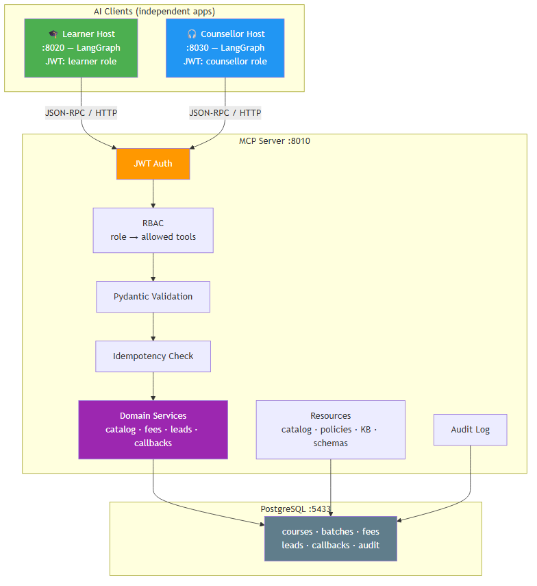

# Admissions MCP Hub

A governed [Model Context Protocol](https://modelcontextprotocol.io) server that exposes course, batch, fee, lead, and callback capabilities to **two independent AI chat apps** via a single MCP contract.

---

## What this proves

- One MCP server, two independent clients (learner + counsellor) — no duplicated integrations
- DB credentials, auth, audit, validation — all centralized on the server
- Writes require a **confirmation gate** (prepare → confirm) — an LLM cannot create a lead alone
- Every tool call is **audited** (actor, client, args hash, result, latency)
- A **no-MCP comparison demo** shows what you'd lose without MCP



---

## Quick start

```bash
# 1. PostgreSQL
docker compose up -d postgres

# 2. Migrate + seed
uv sync
uv run alembic upgrade head
uv run python scripts/seed_demo.py

# 3. Start services (4 terminals)
uv run uvicorn services.mcp_server.app:asgi_app --port 8010
uv run uvicorn services.learner_host.api:app --port 8020
uv run uvicorn services.counsellor_host.api:app --port 8030
uv run streamlit run ui/app.py --server.port 8501
```

Open **http://localhost:8501** — two chat tabs (Learner + Counsellor).

> **No-MCP comparison:** `uv run streamlit run ui/no_mcp_demo.py --server.port 8502`

---

## Try it

### 🎓 Learner Assistant
| Prompt | What happens |
|--------|-------------|
| `What courses do you have?` | Lists 4 courses |
| `Tell me about the agentic AI course` | Batch dates + fee quote + policy |
| `What is the admissions policy?` | Returns policy text |
| `I'd like a callback` | ✅/❌ confirmation gate before creating lead |

### 🎧 Counsellor Console
| Prompt | What happens |
|--------|-------------|
| `What courses are available?` | Lists 4 courses |
| `Show me upcoming batches for agentic AI` | 3 batches with seats |
| `Generate a fee quote for mlops` | Quote ID + total (INR) |
| `List my leads` | Shows assigned leads |
| `Update stage for SCAI-XXXXXXXX to enrolled` | ✅/❌ confirmation gate |

See **[RUN_GUIDE.md](RUN_GUIDE.md)** for full prompts + expected answers.

---

## Architecture

| Port | Service | Role |
|------|---------|------|
| 5433 | PostgreSQL | Source of truth (courses, batches, leads, audit) |
| 8010 | MCP Server | Tools (11) + Resources (8) + Prompts (2), JWT auth, RBAC, audit |
| 8020 | Learner Host | LangGraph app — learner JWT, confirmation gate for writes |
| 8030 | Counsellor Host | LangGraph app — counsellor JWT, lead management |
| 8501 | Streamlit UI | Two chat tabs (MCP-based) |
| 8502 | No-MCP Demo | Same flow, direct DB — shows what MCP protects against |

**Stack:** Python 3.11 · MCP SDK · LangGraph · FastAPI · SQLAlchemy 2 · PostgreSQL 16 · Pydantic v2 · Ollama (qwen3.5:2b) · Streamlit

---

## Key concepts

| Concept | Where | Why it matters |
|---------|-------|---------------|
| **Confirmation gate** | `leads_prepare` → `leads_confirm_create` | LLM can't create a lead without human ✅ |
| **Idempotency** | `IdempotencyRepository` (payload hash) | Network retries don't create duplicates |
| **RBAC** | `ROLE_TOOLS` map in `_runner.py` | Learner can't see other people's leads |
| **Audit** | `ToolAuditEvent` table | Every call logged: who, what, result, latency |
| **Statelessness** | Server-minted IDs (`quote_id`, `lead_id`) | Horizontal scaling without sessions |

---

## Project structure

```
scai-mcp-admissions/
├── services/
│   ├── mcp_server/          # MCP server (tools, resources, prompts, auth, audit)
│   ├── learner_host/        # LangGraph learner app (port 8020)
│   └── counsellor_host/     # LangGraph counsellor app (port 8030)
├── ui/
│   ├── app.py               # Streamlit — 2 chat tabs (MCP)
│   └── no_mcp_demo.py       # Streamlit — no-MCP comparison (direct DB)
├── packages/
│   ├── contracts/           # Pydantic tool inputs/outputs + domain models
│   ├── shared/              # Config, LLM adapter, JWT tokens
│   └── observability/       # Structured logging, tracing
├── scripts/
│   ├── seed_demo.py         # Seed 4 courses, 4 batches, 4 fee plans, 3 policies
│   ├── issue_dev_token.py   # Issue dev JWTs for manual testing
│   └── run_demo_checks.py   # Smoke tests against running server
├── tests/                   # unit, contract, integration, security, e2e
├── migrations/              # Alembic migrations
├── data/demo_seed/          # Seed data + knowledge_base.json
├── mcp_concept.ipynb        # MCP concept notebook (what/why/how/scale/use cases)
├── mcp_flow_diagram.mmd     # Mermaid source for architecture diagram
├── mcp_flow_diagram.png     # Rendered architecture diagram
├── RUN_GUIDE.md             # Step-by-step run guide with test prompts
└── docker-compose.yml        # PostgreSQL 16
```

---

## Tests

```bash
uv run pytest              # all tests
uv run pytest -m unit      # just unit tests
uv run pytest -m contract  # contract tests
```

---

## References

- [MCP Specification (2026-07-28)](https://modelcontextprotocol.io/specification/2026-07-28)
- [MCP Python SDK](https://github.com/modelcontextprotocol/python-sdk)
- [LangGraph](https://docs.langchain.com/oss/python/langgraph)
- [RUN_GUIDE.md](RUN_GUIDE.md) — Full run guide with prompts and expected answers
- [mcp_concept.ipynb](mcp_concept.ipynb) — Complete MCP concept walkthrough